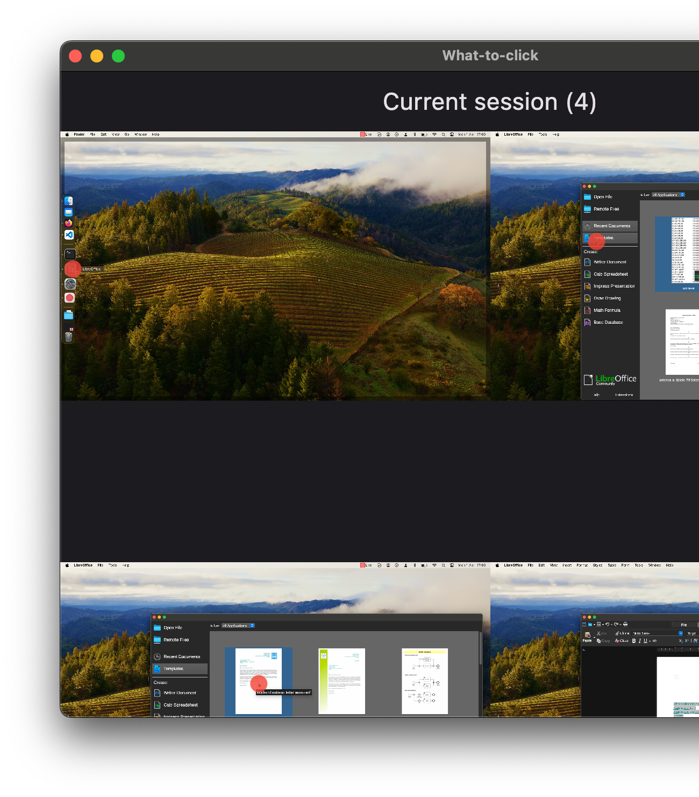

# What-to-click Desktop

Create desktop-wide step-by-step documentation.

### What to click to use What-to-click

1. [Download and install](#installation-macos) What-to-click.
2. Click the circle in system's status bar.
3. Perform necessary actions to achieve the goal you want to document. Each click will be recorded.
4. Click the red square in system's status bar to stop recording.
5. A page with editable text will be opened, containing all of the steps you have performed with screenshots attached. Edit step descriptions to your liking and export or save the file.

#### Installation (macOS)

1. Download the [latest release](https://github.com/what-to-click/desktop/releases/latest).
2. Unzip the downloaded file and drag the What-to-click application to the "Applications" directory.
3. Right-click on the application while holding shift, and click "Open".
